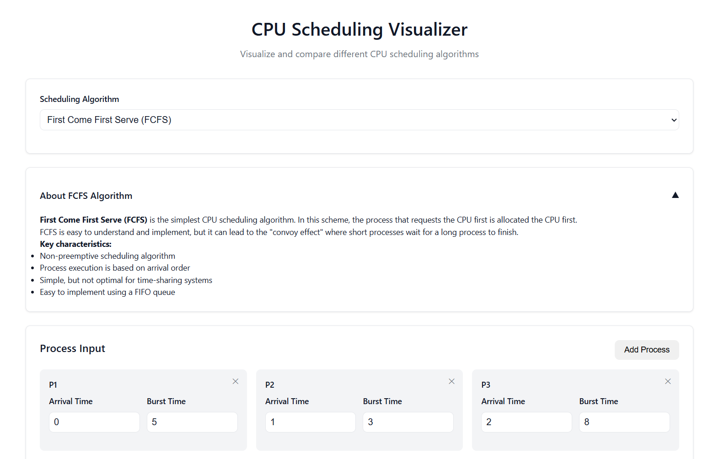
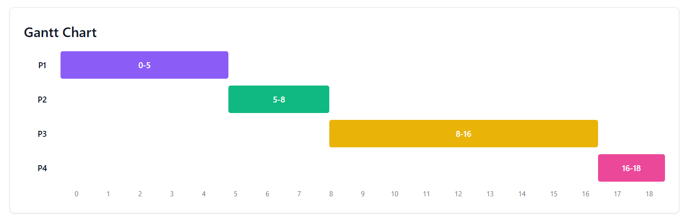
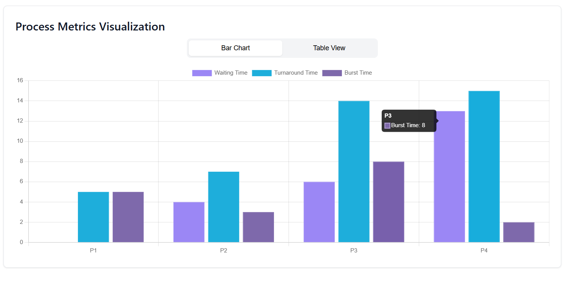
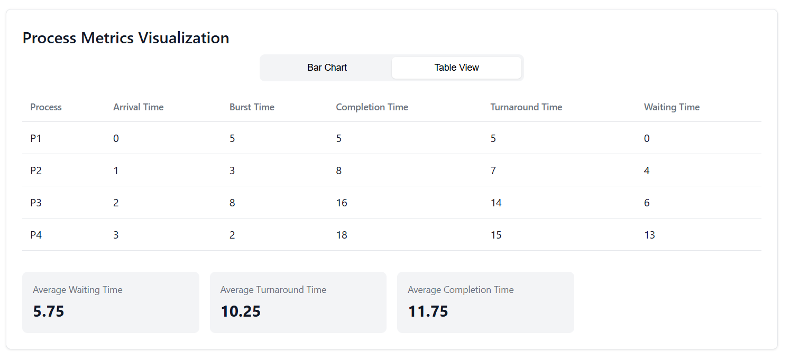

# 🔄 CPU Scheduling Algorithm Visualizer

A lightweight, interactive visualizer for simulating popular CPU scheduling algorithms. Built using just **HTML**, **CSS**, and **JavaScript** — no frameworks or libraries required.

## 🎯 Features

- Visual Gantt chart representation of scheduling
- Supports:
  - First Come First Serve (FCFS)
  - Shortest Job First (SJF)
  - Shortest Remaining Time First (SRTF)
  - Round Robin (RR)
  - Priority Scheduling
- User input for process details
- Real-time calculation of:
  - Waiting Time
  - Turnaround Time
  - Average Times

## 📂 Project Structure
``` cpu-scheduling-visualizer/ ├── index.html ├── styles.css └── script.js ```

## 🖥️ How to Use

1. **Clone or download** this repository.
2. Open `index.html` in any web browser.
3. Input processes, choose the algorithm, and visualize the scheduling!

✅ No installation or setup needed.

## 🖼️ Preview

<!-- Replace the link below with your actual screenshot path or hosted image URL -->
Select Scheduling Algorithum


Gantts' Chart


Visual Graph


Matrix Representation


## 💡 Future Enhancements

- Add support for more advanced scheduling types (e.g., Multilevel Queue)
- Add animations for process transitions
- Improve mobile responsiveness

## 🙌 Contributing

Contributions are welcome! If you'd like to improve or extend the project, feel free to fork it and submit a pull request.

## 🚀 Live Demo

👉 [Click here to view the live project](https://cpu-schedular-visulaization.vercel.app/)


